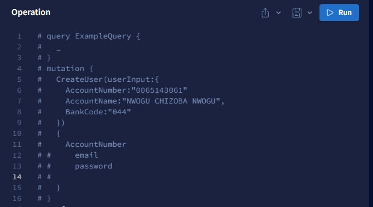

# fungi-graphQl
This is a simple application that collects user bank data and verifies them over a third party API.
If the third party ApI verifies our user, it saves their credentials to the database and updates their verification status to true. Else 
it is saved but the verification status remains false.

# Tools/Technologies Used
- JavaScript/Nodejs
- Apollo GraphQl
- MongODb

# How to use
You might need a graphql playground to make your query requests.

To start the server, type "npm start" at the console
Go to http://localhost:6060/graphql

Make a request to paystack via the playground by inputing your account name and bank code

Get a single user

